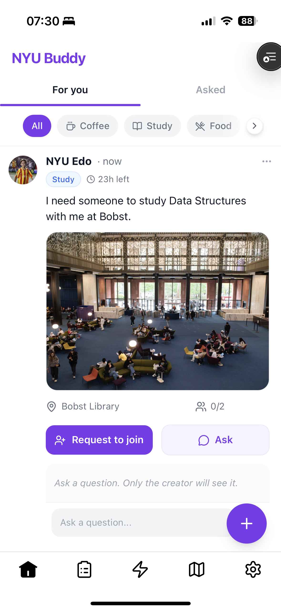
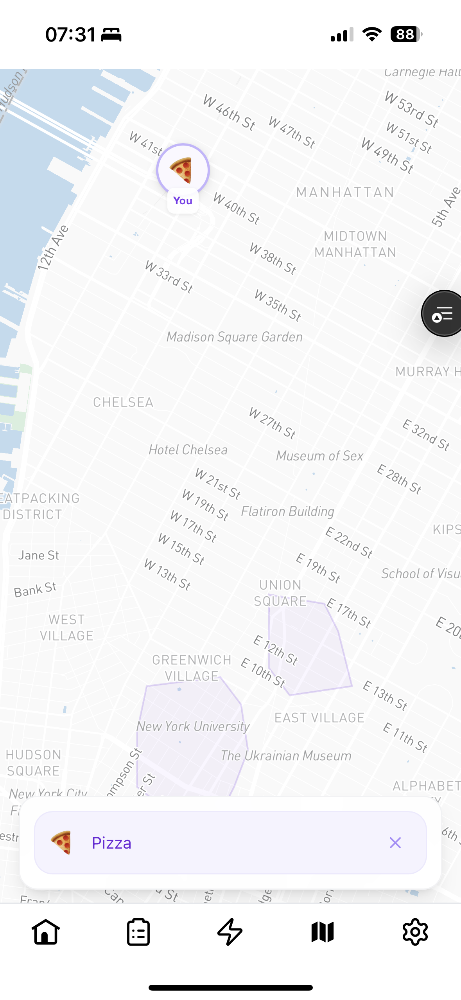

# NYU Buddy

**A real-time campus social app that helps NYU students find people to do things with, right now.**

---

## The Problem

NYU is one of the largest private universities in the US, spread across a dense urban campus with no traditional quad or central gathering space. Students often want to grab coffee, study together, or explore the city — but finding someone available *right now* is surprisingly hard. Group chats get buried, and social media doesn't solve spontaneous, in-person connection.

NYU Buddy closes that gap. It lets students broadcast what they want to do, find nearby matches in real time, and meet up — all within minutes.

---

## Core Features

- **Instant Matching** — Go live with an activity and get matched with nearby students using a proximity + compatibility scoring algorithm. Decide on a place together, then chat.
- **Activity Companion** — Post an activity (study session, coffee run, gym, explore) and let others request to join. Supports group formation and group chat.
- **Real-time Map** — See who's around campus and what they're up to. Set a status visible to nearby students on a custom NYU-styled Mapbox map.
- **Chat** — 1:1 chat for instant matches, group chat for activity companions. Real-time via Firestore listeners.
- **Place Decision** — After matching, both users vote on a meeting spot from curated campus places or search for a custom one. The app resolves the decision automatically.
- **Safety** — Report users, block accounts, rate-limited messaging (500 char / 100 word / 400 message caps), admin review queue.
- **PWA** — Installable on iOS and Android home screens with push notifications via FCM.

---

## Screenshots

<!-- Replace placeholder paths with actual screenshots -->

| Home Feed | Map |
|:---------:|:---:|
|  |  |

---

## Demo

<video src="screenshots/ScreenRecording_02-23-2026%2007-31-38_1.mov" controls muted playsinline width="900">
  Your browser does not support the video tag.
</video>

[Open demo video directly](screenshots/ScreenRecording_02-23-2026%2007-31-38_1.mov)


---

## Tech Stack

| Layer | Technology |
|-------|-----------|
| Framework | Next.js 14 (App Router), React 18, TypeScript |
| Styling | Tailwind CSS, Radix UI, Framer Motion |
| Backend | Firebase (Auth, Firestore, Cloud Functions, Storage) |
| Maps | Mapbox GL JS (custom NYU campus style + building overlays) |
| Places | Google Places API |
| Validation | Zod, React Hook Form |
| Hosting | Vercel (frontend), Firebase (functions + infra) |

---

## Architecture Overview

```
┌─────────────────────────────────────────────────┐
│                   Client (PWA)                   │
│         Next.js 14 · React 18 · TypeScript       │
│                                                   │
│  ┌───────────┐  ┌──────────┐  ┌──────────────┐  │
│  │ Activity   │  │ Instant  │  │  Map Status  │  │
│  │ Companion  │  │ Match    │  │  + Chat      │  │
│  └─────┬─────┘  └────┬─────┘  └──────┬───────┘  │
└────────┼──────────────┼───────────────┼──────────┘
         │              │               │
         ▼              ▼               ▼
┌─────────────────────────────────────────────────┐
│                 Firebase Platform                 │
│                                                   │
│  Auth ─── Firestore (real-time) ─── Storage      │
│                    │                              │
│           Cloud Functions (50+)                   │
│     callable · scheduled · background             │
└───────────────────┬─────────────────────────────┘
                    │
        ┌───────────┼───────────┐
        ▼           ▼           ▼
   Mapbox GL    Google      FCM Push
   (map tiles)  Places API  Notifications
```

The frontend is a single Next.js PWA deployed on Vercel. All business logic runs in Firebase Cloud Functions (50+ callable and scheduled functions) operating on Firestore. The client subscribes to Firestore documents in real time for live updates on matches, chat, presence, and activity feeds.

---

## Project Structure

```
├── src/
│   ├── app/                  # Next.js App Router pages
│   │   ├── (auth)/           #   Login
│   │   ├── (protected)/      #   Home, match, post, map, profile, onboarding
│   │   └── admin/            #   Admin tools
│   ├── components/           # React components (activity, match, map, chat, ui)
│   ├── lib/
│   │   ├── firebase/         #   Client SDK init + callable function wrappers
│   │   ├── hooks/            #   Custom hooks (useAuth, useMatch, useChat, etc.)
│   │   ├── schemas/          #   Zod validation schemas
│   │   └── utils/            #   Retry logic, platform detection
│   ├── context/              # React context providers
│   └── types/                # TypeScript type definitions
├── functions/
│   └── src/                  # Firebase Cloud Functions
│       ├── activity/         #   Activity post CRUD, join requests, group chat
│       ├── matches/          #   Match lifecycle, chat, place decision
│       ├── offers/           #   Offer create/respond/cancel
│       ├── suggestions/      #   Matching algorithm (scoring + filtering)
│       ├── presence/         #   Availability sessions
│       ├── map/              #   Map status broadcasting
│       ├── safety/           #   Report submission
│       └── verification/     #   Email OTP verification
├── scripts/                  # Mapbox pipeline, seed data, migrations
├── public/                   # Static assets, PWA manifest, service worker
├── firestore.rules           # Firestore security rules
├── storage.rules             # Storage security rules
└── firebase.json             # Firebase project config (incl. emulators)
```

---

## Getting Started

### Prerequisites

- **Node.js 20** (see `.nvmrc`)
- **npm** >= 10
- **Firebase CLI** — `npm install -g firebase-tools`
- A **Mapbox** account (free tier works)
- A **Firebase** project with Auth, Firestore, Functions, and Storage enabled
- A **Google Cloud** project with the Places API enabled

### Setup

```bash
# 1. Clone the repo
git clone https://github.com/<your-org>/nyu-buddy.git
cd nyu-buddy

# 2. Use the correct Node version
nvm use

# 3. Install frontend dependencies
npm install

# 4. Install Cloud Functions dependencies
cd functions && npm install && cd ..

# 5. Copy and configure environment variables
cp .env.example .env.local
# Edit .env.local with your Firebase, Mapbox, and Google credentials

# 6. Start the development server
npm run dev
```

Open [http://localhost:3000](http://localhost:3000) in your browser.

### Firebase Emulators (optional)

To run against local Firebase emulators instead of production:

1. Set `NEXT_PUBLIC_USE_EMULATORS=true` in `.env.local`
2. Start emulators in a separate terminal:

```bash
firebase emulators:start
```

The emulator UI is available at [http://localhost:4000](http://localhost:4000).

---

## Environment Variables

Copy `.env.example` to `.env.local` and fill in your values. Variables are grouped as follows:

| Group | Variables | Description |
|-------|-----------|-------------|
| Firebase | `NEXT_PUBLIC_FIREBASE_*` (8 vars) | Firebase project config from the Firebase Console |
| Firebase Push | `NEXT_PUBLIC_FIREBASE_VAPID_KEY` | VAPID key for FCM push notifications |
| Admin | `NEXT_PUBLIC_ADMIN_EMAILS` | Comma-separated emails that bypass the @nyu.edu restriction |
| Mapbox | `NEXT_PUBLIC_MAPBOX_TOKEN` | Public Mapbox token (for the map UI) |
| Mapbox | `MAPBOX_ACCESS_TOKEN`, `MAPBOX_USERNAME` | Server-side Mapbox credentials (for tileset pipeline scripts) |
| Google | `GOOGLE_PLACES_API_KEY` | Google Places API key for place search |
| Google | `GOOGLE_APPLICATION_CREDENTIALS` | Path to Firebase service account JSON (for server-side Admin SDK) |
| Dev | `NEXT_PUBLIC_USE_EMULATORS` | Set to `true` to connect to local Firebase emulators |
| Dev | `NEXT_PUBLIC_SHOW_DESIGN_PLAYGROUND` | Set to `true` to show the design playground route |

Cloud Functions email (OTP verification) requires separate SMTP secrets — see the comments in `.env.example`.

---

## Roadmap

- [ ] Notifications v2 — richer push payloads, in-app notification center
- [ ] Themed meetups — event-style matching around campus happenings
- [ ] Mutual friends / trust signals — surface shared connections
- [ ] Analytics dashboard — usage metrics for campus engagement
- [ ] Multi-campus expansion — generalize beyond NYU

---

## Privacy & Safety

NYU Buddy is designed with student safety in mind:

- **Reporting** — Users can report harassment, spam, inappropriate content, impersonation, or no-shows. Reports are rate-limited (max 5/day) and queued for admin review.
- **Blocking** — Bidirectional blocking. Blocked users are excluded from suggestions, matches, and feeds.
- **Message limits** — 500 characters per message, 100 words per message, 400 total messages per match conversation.
- **Email verification** — OTP-based @nyu.edu email verification to ensure campus affiliation.
- **Firestore security rules** — Row-level access control on all collections.

---

## Contributing

See [CONTRIBUTING.md](CONTRIBUTING.md) for guidelines.

---

## Contact

**Edoardo Mongardi** — [edoardo.mongardi18@gmail.com](mailto:edoardo.mongardi18@gmail.com)

Project Link: [https://github.com/EdoardoMongardi/NYU_Buddy_APP](https://github.com/EdoardoMongardi/NYU_Buddy_APP)
