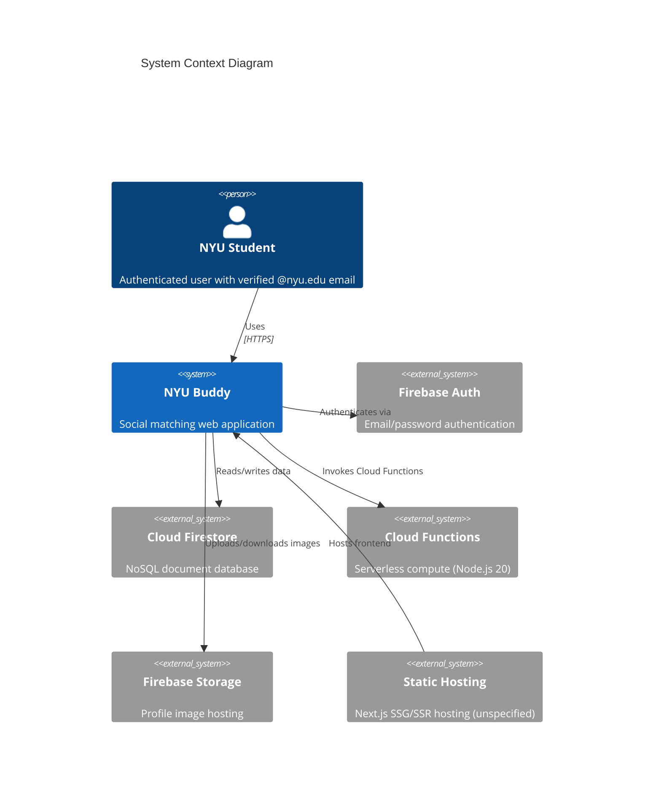
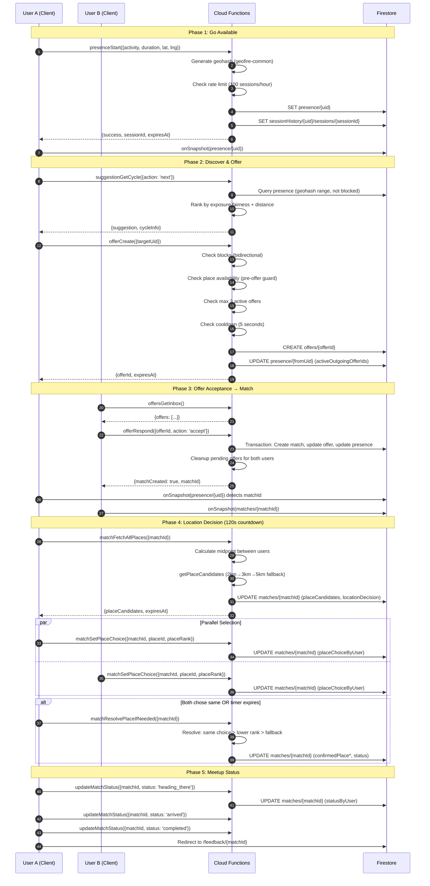

# NYU Buddy Architecture (As-Is)

**Version:** 1.2
**Last Updated:** 2026-02-07
**Source of Truth:** Codebase only

**Changelog:**
- v1.2: Code-truth audit pass — fixed Next.js version (14.2.35 not 15), React version (^18 not 19), flagged Vercel deployment as unverified, documented admin whitelist discrepancy (firestore.rules=1 vs frontend=2), added full dependency versions to §8
- v1.1: Fixed status lists in 9.2, corrected place resolution order in 6.3, added hooks (useCycleSuggestions, useSuggestion), added gap 9.7 (presence.matchId), added constants (REJECTION_COOLDOWN_MS, RADIUS_KM), corrected hosting assumption

---

## Table of Contents

1. [Scope](#1-scope)
2. [System Context](#2-system-context)
3. [Component Architecture](#3-component-architecture)
4. [Key Runtime Flows](#4-key-runtime-flows)
5. [Data Access Patterns](#5-data-access-patterns)
6. [Security Model](#6-security-model)
7. [Deployment Configuration](#7-deployment-configuration)
8. [Technical Stack](#8-technical-stack)
9. [Known Architectural Gaps](#9-known-architectural-gaps)

---

## 1. Scope

This document describes the current implementation architecture of NYU Buddy, a social matching application for NYU students. It covers:

- System context and external dependencies
- Component architecture (frontend, backend, data stores)
- Key runtime flows
- Data access patterns
- Security model
- Deployment configuration
- Known architectural gaps

**Out of scope:** Future roadmap features, theoretical improvements, or aspirational architecture.

---

## 2. System Context

NYU Buddy operates as a serverless web application built on Firebase and Next.js, targeting NYU students for real-time meetup matching.



**Note:** No explicit hosting platform is configured in the codebase. Next.js can be deployed to Vercel, Firebase Hosting, or any Node.js-compatible platform.

### 2.1 External Dependencies

| Dependency | Purpose | Version | Source |
|------------|---------|---------|--------|
| Firebase Auth | User authentication (email/password) | 12.8.0 | `package.json:26` |
| Cloud Firestore | Primary data store | via firebase-admin 13.0.0 | `functions/package.json:18` |
| Cloud Functions v2 | Backend compute | 6.3.0 | `functions/package.json:19` |
| Firebase Storage | Profile image hosting | 12.8.0 | `package.json:26` |
| geofire-common | Geospatial queries | 6.0.0 | `package.json:28`, `functions/package.json:20` |
| Next.js | Frontend framework | 14.2.35 | `package.json:30` |

---

## 3. Component Architecture

### 3.1 Frontend Layer (Next.js App Router)

The frontend is a Next.js 14 application using the App Router pattern with React 18.

#### Route Structure

| Route | Purpose | Auth Required | Source |
|-------|---------|---------------|--------|
| `/login` | Authentication entry | No | `src/app/(auth)/login/page.tsx` |
| `/` | Home/Discovery | Yes | `src/app/(protected)/page.tsx` |
| `/onboarding` | Profile setup | Yes | `src/app/(protected)/onboarding/page.tsx` |
| `/profile` | User settings | Yes | `src/app/(protected)/profile/page.tsx` |
| `/match/[matchId]` | Active match view | Yes | `src/app/(protected)/match/[matchId]/page.tsx` |
| `/feedback/[matchId]` | Post-match feedback | Yes | `src/app/(protected)/feedback/[matchId]/page.tsx` |
| `/admin/spots` | Admin place management | Yes + Admin | `src/app/admin/spots/page.tsx` |

**Code Reference:** Route group layouts at `src/app/(protected)/layout.tsx:10-64`

#### Auth Protection Flow

```typescript
// src/app/(protected)/layout.tsx:20-44
useEffect(() => {
  if (loading) return;
  if (!user) { router.replace('/login'); return; }
  if ((!userProfile || !userProfile.profileCompleted) && pathname !== '/onboarding') {
    router.replace('/onboarding');
    return;
  }
  if (userProfile?.profileCompleted && pathname === '/onboarding') {
    router.replace('/');
    return;
  }
  setIsChecking(false);
}, [user, userProfile, loading, router, pathname]);
```

### 3.2 State Management Layer

Client-side state is managed through React Context and custom hooks.

| Hook | Purpose | Realtime | Source |
|------|---------|----------|--------|
| `useAuth` | Auth state & user profile | Yes (onAuthStateChanged) | `src/components/auth/AuthProvider.tsx:35-161` |
| `usePresence` | User availability session | Yes (onSnapshot) | `src/lib/hooks/usePresence.ts:20-99` |
| `useMatch` | Active match data | Yes (onSnapshot) | `src/lib/hooks/useMatch.ts:35-163` |
| `useOffers` | Inbox/outgoing offers | Hybrid (onSnapshot + polling) | `src/lib/hooks/useOffers.ts:17-263` |
| `useLocationDecision` | Place selection state | Yes (onSnapshot) | `src/lib/hooks/useLocationDecision.ts:67-258` |
| `useCycleSuggestions` | Cycle-based discovery | Polling (on action) | `src/lib/hooks/useCycleSuggestions.ts:6-97` |
| `useSuggestion` | Legacy suggestion (unused) | Polling | `src/lib/hooks/useSuggestion.ts` |

**Realtime Subscription Pattern:**

```typescript
// src/lib/hooks/usePresence.ts:34-55
const unsubscribe = onSnapshot(
  doc(getFirebaseDb(), 'presence', user.uid),
  (doc) => {
    if (doc.exists()) {
      const data = doc.data() as PresenceData;
      if (data.expiresAt.toMillis() > Date.now()) {
        setPresence(data);
      } else {
        setPresence(null);
      }
    } else {
      setPresence(null);
    }
    setLoading(false);
  },
  (err) => { /* error handling */ }
);
```

### 3.3 Cloud Functions Layer

19 onCall functions + 1 onSchedule function, all deployed to `us-east1`.

**Code Reference:** Function registration at `functions/src/index.ts:31-136`

See: API_Contract_AsIs.md#1-api-surface-summary

#### Function Configuration

```typescript
// functions/src/index.ts:31-34
export const presenceStart = onCall(
  { region: 'us-east1' },
  presenceStartHandler
);
```

All functions use identical configuration: `{ region: 'us-east1' }`.

### 3.4 Data Store Layer

Cloud Firestore serves as the primary database with 11 collections.

See: DataModel_AsIs.md#1-overview

### 3.5 Client SDK Configuration

Firebase client initialization with lazy loading and emulator support.

```typescript
// src/lib/firebase/client.ts:7-14
const firebaseConfig = {
  apiKey: process.env.NEXT_PUBLIC_FIREBASE_API_KEY,
  authDomain: process.env.NEXT_PUBLIC_FIREBASE_AUTH_DOMAIN,
  projectId: process.env.NEXT_PUBLIC_FIREBASE_PROJECT_ID,
  storageBucket: process.env.NEXT_PUBLIC_FIREBASE_STORAGE_BUCKET,
  messagingSenderId: process.env.NEXT_PUBLIC_FIREBASE_MESSAGING_SENDER_ID,
  appId: process.env.NEXT_PUBLIC_FIREBASE_APP_ID,
};

// src/lib/firebase/client.ts:33
functions = getFunctions(app, 'us-east1');
```

**Function Callable Pattern:**

```typescript
// src/lib/firebase/functions.ts:5-13
function createCallable<TRequest, TResponse>(name: string): HttpsCallable<TRequest, TResponse> {
  let callable: HttpsCallable<TRequest, TResponse> | null = null;
  return ((data?: TRequest) => {
    if (!callable) {
      callable = httpsCallable<TRequest, TResponse>(getFirebaseFunctions(), name);
    }
    return callable(data);
  }) as HttpsCallable<TRequest, TResponse>;
}
```

---

## 4. Key Runtime Flows

### 4.1 Availability → Match → Meetup Flow



**Code References:**
- Presence start: `functions/src/presence/start.ts:16-120`
- Offer create: `functions/src/offers/create.ts:17-310`
- Place candidates: `functions/src/utils/places.ts:48-86`
- Location decision hook: `src/lib/hooks/useLocationDecision.ts:67-258`

---

## 5. Data Access Patterns

### 5.1 Geospatial Queries (geofire-common)

```typescript
// functions/src/utils/places.ts:99-111
const bounds = geofire.geohashQueryBounds(center, radiusInM);

for (const b of bounds) {
  const q = db
    .collection('places')
    .where('active', '==', true)
    .orderBy('geohash')
    .startAt(b[0])
    .endAt(b[1]);
  placePromises.push(q.get());
}
```

**Radius Fallback Algorithm:**

```typescript
// functions/src/utils/places.ts:62-79
for (const radiusKm of radii) {
  const places = await fetchPlacesWithinRadius(...);
  allPlaces = places;
  if (places.length >= softMin) {
    break;  // Found enough candidates
  }
}
```

See: StateMachine_AsIs.md#3-constants--configuration for place query constants.

### 5.2 Transaction Patterns

Match creation uses Firestore transactions for atomicity:

```typescript
// functions/src/offers/create.ts:186-232
await db.runTransaction(async (transaction) => {
  // Create match
  transaction.set(matchRef, { ... });
  // Update reverse offer to accepted
  transaction.update(reverseOffer.ref, { status: 'accepted', matchId: matchRef.id });
  // Update target's presence
  transaction.update(db.collection('presence').doc(targetUid), {
    status: 'matched',
    matchId: matchRef.id,
  });
  // Update sender's presence
  transaction.update(fromPresenceDoc.ref, {
    status: 'matched',
    matchId: matchRef.id,
  });
});
```

### 5.3 Denormalization Strategy

Offer documents denormalize receiver profile data to avoid additional reads:

```typescript
// functions/src/offers/create.ts:272-287
transaction.set(offerRef, {
  fromUid,
  toUid: targetUid,
  toDisplayName,        // Denormalized
  toPhotoURL,           // Denormalized
  activity: fromPresence.activity,
  // ...
});
```

---

## 6. Security Model

### 6.1 Authentication

- Firebase Auth with email/password
- NYU email domain enforcement (frontend only)
- Email verification required for full functionality

**Code Reference:** `src/components/auth/AuthProvider.tsx:88-123`

### 6.2 Firestore Security Rules Summary

See: DataModel_AsIs.md#appendix-b-firestore-security-rules-summary

**Admin Whitelist:**

```javascript
// firestore.rules:16-18
function isAdmin() {
  return isAuthenticated() &&
    request.auth.token.email in ['edoardo.mongardi18@gmail.com'];
}
```

### 6.3 Trust Boundaries

| Data Source | Trusted | Validation |
|-------------|---------|------------|
| Client SDK (Firestore direct) | Limited | Security rules |
| Cloud Functions | High | Authenticated + validated |
| Server Timestamps | Trusted | FieldValue.serverTimestamp() |

---

## 7. Deployment Configuration

### 7.1 Firebase Project Structure

```json
// firebase.json
{
  "firestore": {
    "rules": "firestore.rules",
    "indexes": "firestore.indexes.json"
  },
  "functions": [{
    "source": "functions",
    "codebase": "default",
    "predeploy": ["npm --prefix \"$RESOURCE_DIR\" run build"]
  }],
  "emulators": {
    "auth": { "port": 9099 },
    "functions": { "port": 5001 },
    "firestore": { "port": 8080 },
    "ui": { "enabled": true, "port": 4000 }
  }
}
```

### 7.2 Cloud Functions Runtime

- **Node.js:** 20 (`functions/package.json:15`)
- **Region:** us-east1 (all functions)
- **Trigger Type:** 19 onCall + 1 onSchedule

### 7.3 Next.js Configuration

```javascript
// next.config.mjs
const nextConfig = {
  images: {
    remotePatterns: [
      { protocol: 'https', hostname: 'firebasestorage.googleapis.com', pathname: '/v0/b/**' },
      { protocol: 'https', hostname: 'images.unsplash.com' },
    ],
  },
};
```

### 7.4 Environment Variables

| Variable | Purpose | Source |
|----------|---------|--------|
| `NEXT_PUBLIC_FIREBASE_API_KEY` | Firebase client config | `.env.local` |
| `NEXT_PUBLIC_FIREBASE_AUTH_DOMAIN` | Firebase client config | `.env.local` |
| `NEXT_PUBLIC_FIREBASE_PROJECT_ID` | Firebase client config | `.env.local` |
| `NEXT_PUBLIC_FIREBASE_STORAGE_BUCKET` | Firebase client config | `.env.local` |
| `NEXT_PUBLIC_FIREBASE_MESSAGING_SENDER_ID` | Firebase client config | `.env.local` |
| `NEXT_PUBLIC_FIREBASE_APP_ID` | Firebase client config | `.env.local` |
| `NEXT_PUBLIC_USE_EMULATORS` | Enable emulator mode | `.env.local` (optional) |

---

## 8. Technical Stack

**Frontend:**
- Next.js 14.2.35 (App Router) — `package.json:30`
- React ^18 — `package.json:31`
- TypeScript ^5 — `package.json:47`
- Tailwind CSS ^3.4.1 — `package.json:46`
- Shadcn UI (Radix primitives)
- Framer Motion ^12.29.2 — `package.json:27`
- Firebase SDK ^12.8.0 (Firestore, Auth, Storage) — `package.json:26`
- Zod ^4.3.6 (schema validation) — `package.json:37`

**Backend:**
- Firebase Cloud Functions v2 (Node.js 20, TypeScript) — `functions/package.json:14,19`
- firebase-admin ^13.0.0 — `functions/package.json:18`
- firebase-functions ^6.3.0 — `functions/package.json:19`
- Firestore (database)
- Firebase Authentication
- Firebase Storage (profile pictures)
- geofire-common ^6.0.0 — `functions/package.json:20`
- uuid ^13.0.0 — `functions/package.json:21`

**Deployment:**
- **[NOT VERIFIED IN CODE]** Frontend hosting platform (no `vercel.json` or hosting configuration in codebase)
- Firebase Functions (us-east1 region)

---

## 9. Known Architectural Gaps

### 9.1 ~~No Push Notification System~~ ✅ RESOLVED (U16)

**Status:** ✅ **RESOLVED** (2026-02-08)

**Pre-U16 Issue:**
Match notifications relied on:
1. Firestore `onSnapshot` listeners (requires app open)
2. Polling (30-second intervals in `src/app/(protected)/page.tsx:77-86`)
3. **Impact:** High - users missed time-sensitive offers/matches, battery drain

**U16 Resolution:**

**Part 1: Firebase Cloud Messaging (FCM) Push Notifications**

**Backend Implementation:**
- **Notification Utilities** (`functions/src/utils/notifications.ts` - NEW):
  - `sendNotificationToUser()` - Core FCM sending logic with Firebase Admin SDK
  - `sendOfferReceivedNotification()` - Sends "You received an offer from XXX"
  - `sendMatchCreatedNotification()` - Sends "You have successfully matched with XXX"
  - Handles invalid token cleanup (removes stale FCM tokens)
  - Platform-specific payloads (Android high priority, iOS APNs configuration)

- **Integration Points:**
  - `functions/src/offers/create.ts` - Notification on offer creation + mutual match
  - `functions/src/offers/respond.ts` - Notification on match acceptance
  - Fire-and-forget pattern (non-blocking, errors logged but don't fail main operation)

**Frontend Implementation:**
- **Hook** (`src/lib/hooks/useNotifications.ts` - NEW):
  - Permission management: `requestPermission()` prompts user
  - FCM token registration via `getToken()` with VAPID key
  - Token storage in Firestore (`users/{uid}.fcmToken`)
  - Environment variable: `NEXT_PUBLIC_FIREBASE_VAPID_KEY`

- **User Prompt** (`src/components/notifications/NotificationPrompt.tsx` - NEW):
  - Banner with gradient violet background (matching app theme)
  - "Enable notifications for updates" messaging
  - Error handling for permission denied, VAPID key missing, etc.
  - Dismissible with localStorage persistence

- **Service Worker** (`public/firebase-messaging-sw.js` - NEW):
  - Handles background notifications when app not in focus
  - Shows system notification with title, body, icon
  - Firebase Messaging compat library (v10.7.1)

- **Debug Tool** (`src/app/(protected)/notifications-debug/page.tsx` - NEW):
  - Configuration status checker (VAPID key, permissions, FCM token)
  - Browser support detection
  - Test notification sender
  - Platform-specific troubleshooting guide

**Part 2: PWA Installation Banner for iOS Notifications**

**Problem:** iOS Safari requires PWA installation for Notification API access.

**Platform Detection** (`src/lib/utils/platform.ts` - NEW):
- Robust iOS Safari detection: `/Safari/.test(ua) && !/CriOS|FxiOS|EdgiOS/.test(ua)`
- Detects iOS, Android, Desktop platforms
- Dual standalone detection: `matchMedia('(display-mode: standalone)')` + `navigator.standalone`
- Identifies iOS Chrome, Edge, Firefox (requires redirect to Safari)

**Installation State Management** (`src/lib/hooks/useInstallation.ts` - NEW):
- localStorage keys: `installBannerDismissUntil` (timestamp), `installBannerInstalled` (boolean)
- 24-hour "Later" dismissal mechanism
- Android `appinstalled` event listener (auto-marks as installed)
- `beforeinstallprompt` event capture for native Android install prompt

**Installation Components:**
- **Main Banner** (`src/components/installation/InstallBanner.tsx` - NEW):
  - Platform-specific messaging (iOS Safari: "Add to Home Screen", iOS Chrome: "Install from Safari", Android: "Install NYU Buddy")
  - Styled to match `NotificationPrompt` (gradient violet background, responsive)
  - Shows below navbar, above main content

- **iOS Safari Guide** (`src/components/installation/IOSInstallGuide.tsx` - NEW):
  - Visual step-by-step modal: Share → Add to Home Screen → Add → Open
  - Icons for each step with color-coded badges
  - Explains benefits: notifications, offline access, app-like experience

- **Android Guide** (`src/components/installation/AndroidInstallGuide.tsx` - NEW):
  - Manual installation steps: Menu → Install app → Confirm
  - Fallback for browsers without native install prompt

- **iOS Safari Prompt** (`src/components/installation/IOSSafariPrompt.tsx` - NEW):
  - For iOS Chrome/Edge/Firefox users: prompts to switch to Safari
  - Primary action: "Copy Link" (guaranteed to work)
  - Secondary action: "Try Opening in Safari" (best-effort, shows fallback instructions)

**PWA Configuration:**
- **Manifest** (`public/manifest.json` - UPDATED):
  - `"display": "standalone"` - Critical for iOS notifications (enables Notification API)
  - App icons: `/icon-192.svg`, `/icon-512.svg` (purple NYU logos)
  - Theme color: `#7c3aed` (violet), start URL: `/`

- **Metadata** (`src/app/layout.tsx` - UPDATED):
  - Added `manifest: "/manifest.json"`
  - Added `appleWebApp` configuration for iOS home screen
  - Viewport settings optimized for mobile

**Integration:**
- Added `<InstallBanner />` to `src/app/(protected)/layout.tsx` (below `<NotificationPrompt />`)
- Both banners parallel, same styling, shown sequentially

**Behavior:**
- **Desktop:** No installation banner (hidden by design)
- **iOS Safari:** "Add to Home Screen" banner → Visual guide on tap
- **iOS Chrome/Edge/Firefox:** "Install from Safari" banner → Copy link + redirect flow
- **Android:** "Install NYU Buddy" banner → Native prompt or manual guide
- **All platforms:** Banner disappears permanently when app opens in standalone mode

**Environment Configuration:**
- **Local:** `.env.local` - `NEXT_PUBLIC_FIREBASE_VAPID_KEY=<key>`
- **Production:** Vercel environment variables
- **VAPID Key Generation:** Firebase Console → Project Settings → Cloud Messaging → Web Push certificates

**Verification:**
- ✅ FCM notifications working on Android (browser + PWA)
- ✅ FCM notifications working on iOS (PWA standalone mode only)
- ✅ Installation banner detects platform correctly
- ✅ PWA installs successfully on iOS Safari (opens without address bar)
- ✅ PWA installs successfully on Android Chrome (native prompt)
- ✅ Notification API exposed after PWA installation on iOS

**Impact:**
- **High** - Eliminates polling (battery savings)
- Real-time push notifications for offers and matches
- Guided installation flow improves PWA adoption
- Platform-specific UX optimization (handles iOS limitations gracefully)

### 9.2 No Retry/Idempotency Mechanism

Failed Cloud Function calls have no automatic retry or idempotency keys, which could cause duplicate offers or missed state updates.

### 9.3 ~~Hardcoded Admin Whitelist Discrepancy~~ ✅ RESOLVED (U13)

**Status:** ✅ **RESOLVED** (2026-02-08)

**Pre-U13 Issue:** The two admin whitelists did not match - server-side rules had 1 email, client-side had 2 emails, causing the second admin to be blocked from Firestore writes.

**U13 Resolution:**
- ✅ `firestore.rules:17-23` now includes BOTH emails: `edoardo.mongardi18@gmail.com`, `468327494@qq.com`
- ✅ Matches client-side `ADMIN_EMAILS` in `src/lib/schemas/user.ts:4-7`
- ✅ Both admins can now write to `places` and read `reports`
- ✅ Cloud Functions middleware also enforces same whitelist (`utils/auth.ts`)

**Remaining Gap:** Admin access still uses hardcoded email lists (not a scalable admin management system), but the discrepancy between client/server whitelists is resolved.

### 9.4 Client-Side Location Staleness Only

Location staleness (5-minute threshold) is checked server-side but coordinates are never refreshed during an active session.

```typescript
// functions/src/utils/places.ts:182-188
const isStale = updatedAt
  ? (now - updatedAt.toMillis()) > LOCATION_STALE_THRESHOLD_MS
  : true;
```

### 9.5 ~~Security Rules Enforcement Gap~~ ✅ RESOLVED (Phase 3)

**Status:** ✅ **RESOLVED** in Phase 3 (2026-02-08)

**Pre-Phase 3 Issue:**
- **Matches:** Rules allowed `isMatchParticipant` to update documents directly, bypassing backend logic
- **Presence:** Rules allowed `isOwner` to write directly
- **Risk:** Clients could write arbitrary data, bypassing Cloud Function validation logic

**Phase 3 Resolution** (`firestore.rules` deployed 2026-02-08):
- **Matches:** `allow update: if false;` (lines 69-74) - ALL updates blocked, Cloud Functions only
- **Presence:** `allow write: if false;` (lines 39-42) - ALL writes blocked, Cloud Functions only
- **sessionHistory:** `allow read, write: if false;` (lines 113-115) - Explicit deny for client SDK

**Verification:**
- ✅ Local emulator testing: Direct writes blocked (4/4 permission-denied)
- ✅ Cloud Functions operational: All callable functions working (7/7 tested)
- ✅ Production testing: End-to-end flow validated, zero Firestore errors

**Code Evidence:** `firestore.rules:39-42, 69-74, 113-115`

> **Additional known gaps:** See StateMachine_AsIs.md#9-known-inconsistencies--ambiguities (inconsistent status lists, phantom statuses), API_Contract_AsIs.md#6-known-contract-gaps (presence.matchId writes, match creation schemas), and DataModel_AsIs.md#15-known-issues--data-integrity-concerns (missing security rules, phantom fields).

---

**END OF DOCUMENT**