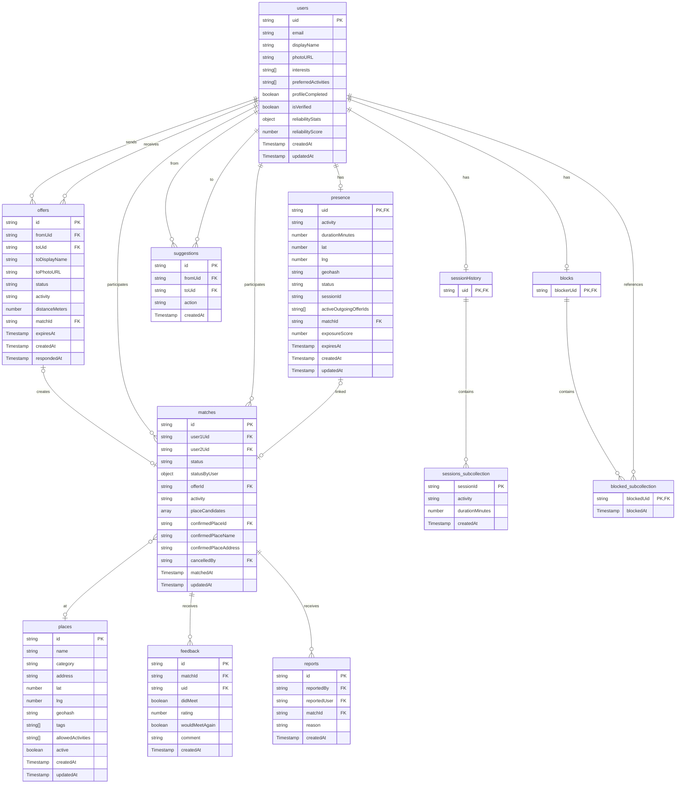

# NYU Buddy - Firestore Data Model (AS-IS)

**Document Version:** 1.4
**Generated:** 2026-02-06
**Last Validated:** 2026-02-07
**Scope:** Complete data model documentation reflecting the current codebase implementation
**Methodology:** All specifications derived exclusively from codebase analysis

---

## Table of Contents

1. [Overview](#1-overview)
   - [Entity Relationship Diagram](#entity-relationship-diagram)
2. [Collection: users](#2-collection-users)
3. [Collection: presence](#3-collection-presence)
4. [Collection: offers](#4-collection-offers)
5. [Collection: matches](#5-collection-matches)
6. [Collection: places](#6-collection-places)
7. [Collection: feedback](#7-collection-feedback)
8. [Collection: reports](#8-collection-reports)
9. [Collection: blocks](#9-collection-blocks)
10. [Collection: suggestions](#10-collection-suggestions)
11. [Collection: sessionHistory](#11-collection-sessionhistory)
12. [Cross-Document References](#12-cross-document-references)
13. [Write Authority Summary](#13-write-authority-summary)
14. [Retention & Cleanup Policies](#14-retention--cleanup-policies)
15. [Known Issues & Data Integrity Concerns](#15-known-issues--data-integrity-concerns)
- [Appendix A: Field Type Reference](#appendix-field-type-reference)
- [Appendix B: Firestore Security Rules Summary](#appendix-b-firestore-security-rules-summary)

---

## 1. Overview

NYU Buddy uses Firestore as its primary database. The data model consists of 11 collections supporting user profiles, real-time availability matching, offer management, meetup coordination, and safety features.

### Architecture Pattern
- **Document ID Strategy:** User-keyed documents use `uid` as document ID; auto-generated IDs for transactional records
- **Subcollection Pattern:** Used for `blocks/{uid}/blocked` and `sessionHistory/{uid}/sessions`
- **Geospatial Queries:** Implemented via geohash field + bounded queries (using `geofire-common`)

### Timestamp Convention
All timestamps use `admin.firestore.Timestamp` (server) or `serverTimestamp()` (client).

### Entity Relationship Diagram

> **Note on Subcollections:** Collections `blocks` and `sessionHistory` use Firestore's subcollection pattern. The parent documents (`blocks/{uid}` and `sessionHistory/{uid}`) serve as path containers and may not exist as actual documents—only their subcollections (`blocked` and `sessions`) contain data.



### Relationship Summary

| From | To | Relationship | Cardinality |
|------|-----|--------------|-------------|
| `users` | `presence` | User has active session | 1:0..1 |
| `users` | `offers` | User sends/receives offers | 1:N |
| `users` | `matches` | User participates in matches | 1:N |
| `users` | `feedback` | User submits feedback | 1:N |
| `users` | `reports` | User files/receives reports | 1:N |
| `users` | `blocks` | User blocks others | 1:N |
| `users` | `suggestions` | User interacts with suggestions | 1:N |
| `users` | `sessionHistory` | User has session history | 1:1 (parent) |
| `offers` | `matches` | Offer creates match | 1:0..1 |
| `matches` | `places` | Match confirms place | N:0..1 |
| `matches` | `feedback` | Match receives feedback | 1:0..2 |
| `matches` | `reports` | Match receives reports | 1:N |
| `presence` | `offers` | Presence tracks active offers | 1:N |
| `presence` | `matches` | Presence links to match | 1:0..1 |

---

## 2. Collection: users

**Purpose:** Persistent user profile storage
**Document ID:** `{uid}` (Firebase Auth UID)

### Schema

| Field | Type | Required | Default | Write Authority | Description |
|-------|------|----------|---------|-----------------|-------------|
| `uid` | `string` | Yes | — | Client (signUp) | Firebase Auth UID |
| `email` | `string` | Yes | — | Client (signUp) | User's email address |
| `displayName` | `string` | Yes | `''` | Client (onboarding) | Display name chosen by user |
| `photoURL` | `string` | No | — | Client (onboarding/profile) | Profile picture URL (Firebase Storage). NOT set at signUp, only added during onboarding if user uploads photo. |
| `interests` | `string[]` | Yes | `[]` | Client (onboarding) | User interests (max 10) |
| `preferredActivities` | `string[]` | Yes | `[]` | Client (onboarding) | Preferred meetup activities (max 5) |
| `profileCompleted` | `boolean` | Yes | `false` | Client (onboarding) | Whether onboarding is complete |
| `isVerified` | `boolean` | Yes | `false` | Client (AuthProvider sync) | Email verification status |
| `reliabilityStats` | `object` | No | — | Cloud Function | Meetup reliability statistics |
| `reliabilityStats.totalMatches` | `number` | — | `0` | Cloud Function | Total matches participated |
| `reliabilityStats.metConfirmed` | `number` | — | `0` | Cloud Function | Successfully completed meetups |
| `reliabilityStats.cancelledByUser` | `number` | — | `0` | Cloud Function | User-initiated cancellations |
| `reliabilityStats.noShow` | `number` | — | `0` | Cloud Function | No-show incidents |
| `reliabilityStats.expired` | `number` | — | `0` | Cloud Function | Expired matches |
| `reliabilityScore` | `number` | No | — | Cloud Function | Calculated reliability (0-1) |
| `createdAt` | `Timestamp` | Yes | — | Client (signUp) | Account creation timestamp |
| `updatedAt` | `Timestamp` | Yes | — | Client/Cloud Function | Last modification timestamp |

### Code References
- **Creation:** `src/components/auth/AuthProvider.tsx:107-117`
- **Onboarding Update:** `src/app/(protected)/onboarding/page.tsx:113-122`
- **reliabilityStats Update:** `functions/src/matches/cancel.ts:112-139`
- **isVerified Sync:** `src/components/auth/AuthProvider.tsx:49-55`

### Lifecycle
1. **Created:** On Firebase Auth `signUp` (AuthProvider)
2. **Updated:** During onboarding, profile edits, email verification sync
3. **reliabilityStats Updated:** On match cancellation (Cloud Function)
4. **Deleted:** Never (no deletion logic in codebase) [UNCONFIRMED]

### reliabilityScore Calculation
```
Formula: functions/src/matches/cancel.ts:128-133
rawScore = (metConfirmed * 1.0 - cancelledByUser * penaltyMultiplier - noShow * 0.5) / totalMatches
reliabilityScore = max(0, min(1, 0.5 + rawScore * 0.5))
```

---

## 3. Collection: presence

**Purpose:** Real-time user availability sessions
**Document ID:** `{uid}` (Firebase Auth UID)

### Schema

**Fields created at `presenceStart`:**

| Field | Type | Required | Default | Write Authority | Description |
|-------|------|----------|---------|-----------------|-------------|
| `uid` | `string` | Yes | — | Cloud Function | Firebase Auth UID |
| `activity` | `string` | Yes | — | Cloud Function | Selected activity type |
| `durationMinutes` | `number` | Yes | — | Cloud Function | Requested session duration (15-240) |
| `lat` | `number` | Yes | — | Cloud Function | Latitude coordinate |
| `lng` | `number` | Yes | — | Cloud Function | Longitude coordinate |
| `geohash` | `string` | Yes | — | Cloud Function | Geohash for geo-queries |
| `status` | `string` | Yes | `'available'` | Cloud Function | `'available'` or `'matched'` |
| `sessionId` | `string` | Yes | — | Cloud Function | UUID for rate limiting reference |
| `seenCandidateIds` | `string[]` | Yes | `[]` | Cloud Function | [DEPRECATED] Legacy field |
| `activeOutgoingOfferId` | `string` | Yes | `null` | Cloud Function | [LEGACY] Single active offer ID |
| `offerCooldownUntil` | `Timestamp` | Yes | `null` | Cloud Function | Cooldown between sending offers |
| `exposureScore` | `number` | Yes | `0` | Cloud Function | Fairness counter for discovery ranking |
| `lastExposedAt` | `Timestamp` | Yes | `null` | Cloud Function | When last shown to another user |
| `expiresAt` | `Timestamp` | Yes | — | Cloud Function | Session expiration (duration + 5min grace) |
| `createdAt` | `Timestamp` | Yes | — | Cloud Function | Session start timestamp |
| `updatedAt` | `Timestamp` | Yes | — | Cloud Function | Last modification timestamp |

**Fields added via updates (NOT present initially):**

| Field | Type | Added By | Description |
|-------|------|----------|-------------|
| `activeOutgoingOfferIds` | `string[]` | `offerCreate` (arrayUnion) | Active outgoing offer IDs (max 3) |
| `seenUids` | `string[]` | `suggestionPass` (arrayUnion) | Users seen in current suggestion cycle |
| `lastViewedUid` | `string` | `suggestionPass` | Last user shown (for rotation) |
| `recentlyExpiredOfferUids` | `string[]` | `offerRespond` (decline) | UIDs for cycle deprioritization |
| `matchId` | `string` | `offerCreate`/`offerRespond` | Active match ID (when status='matched') |

**Fields read but NEVER written [UNCONFIRMED]:**

| Field | Type | Default if Missing | Read Location | Description |
|-------|------|-------------------|---------------|-------------|
| `meetRate` | `number` | `0.5` | `getCycle.ts:270,295` | Used in reliability scoring but never written |
| `cancelRate` | `number` | `0` | `getCycle.ts:270,296` | Used in reliability scoring but never written |

### Code References
- **Creation:** `functions/src/presence/start.ts:83-101`
- **Status Update (matched):** `functions/src/offers/respond.ts:225-234`, `functions/src/offers/create.ts:217-231`
- **exposureScore Increment:** `functions/src/offers/create.ts:297-298`
- **seenUids/lastViewedUid Update:** `functions/src/suggestions/getCycle.ts:473-477`
- **Deletion:** `functions/src/presence/end.ts:32`

### Lifecycle
1. **Created:** `presenceStart` Cloud Function call
2. **Updated:** Offer operations, suggestion cycle navigation, match creation
3. **Deleted:** `presenceEnd` Cloud Function call OR lazy expiration (doc remains but is filtered by `expiresAt`)
4. **exposureScore Reset:** Implicitly reset on new session creation (new doc)

### Constants

See: StateMachine_AsIs.md#3-constants--configuration

---

## 4. Collection: offers

**Purpose:** Matching offers sent between users
**Document ID:** Auto-generated

### Schema

| Field | Type | Required | Default | Write Authority | Description |
|-------|------|----------|---------|-----------------|-------------|
| `fromUid` | `string` | Yes | — | Cloud Function | Sender's UID |
| `toUid` | `string` | Yes | — | Cloud Function | Recipient's UID |
| `toDisplayName` | `string` | Yes | — | Cloud Function | Recipient's display name (denormalized) |
| `toPhotoURL` | `string` | No | `null` | Cloud Function | Recipient's photo URL (denormalized) |
| `status` | `string` | Yes | `'pending'` | Cloud Function | `'pending'` \| `'accepted'` \| `'declined'` \| `'expired'` \| `'cancelled'` |
| `activity` | `string` | Yes | — | Cloud Function | Activity type for the meetup |
| `fromDurationMinutes` | `number` | Yes | — | Cloud Function | Sender's session duration |
| `toDurationMinutes` | `number` | Yes | — | Cloud Function | Recipient's session duration |
| `distanceMeters` | `number` | Yes | `0` | Cloud Function | Distance between users |
| `explanation` | `string` | No | `''` | Cloud Function | Why this user was suggested |
| `matchScore` | `number` | No | `0` | Cloud Function | Compatibility score |
| `matchId` | `string` | No | `null` | Cloud Function | Associated match ID (if accepted) |
| `cancelReason` | `string` | No | — | Cloud Function | `'matched_elsewhere'` (from cleanup) |
| `expiresAt` | `Timestamp` | Yes | — | Cloud Function | Offer expiration timestamp |
| `createdAt` | `Timestamp` | Yes | — | Cloud Function | Offer creation timestamp |
| `respondedAt` | `Timestamp` | No | `null` | Cloud Function | When offer was responded to |
| `updatedAt` | `Timestamp` | No | — | Cloud Function | Added during cleanup/cancel (not at creation) |

### Code References
- **Creation:** `functions/src/offers/create.ts:272-287`
- **Accept Response:** `functions/src/offers/respond.ts:218-222`
- **Decline Response:** `functions/src/offers/respond.ts:62-65`
- **Expire Marking:** `functions/src/offers/respond.ts:51-54`, `functions/src/offers/respond.ts:109-112`
- **Cancel (cleanup):** `functions/src/offers/cleanup.ts:26-30`, `functions/src/offers/cleanup.ts:44-48`

### Lifecycle
1. **Created:** `offerCreate` Cloud Function
2. **Status Transitions:**
   - `pending` → `accepted` (offer accepted, match created)
   - `pending` → `declined` (user declined)
   - `pending` → `expired` (TTL exceeded or presence expired)
   - `pending` → `cancelled` (user matched elsewhere)
3. **Expiration:** Lazy check on access; no scheduled cleanup [CONFIRMED]

### Constants

See: StateMachine_AsIs.md#3-constants--configuration

### Expiration Calculation
```typescript
// functions/src/offers/create.ts:256-262
expiresAt = min(10_minutes_from_now, sender.expiresAt, receiver.expiresAt)
```

---

## 5. Collection: matches

**Purpose:** Confirmed meetup sessions between two users
**Document ID:** Auto-generated

### Schema

| Field | Type | Required | Default | Write Authority | Description |
|-------|------|----------|---------|-----------------|-------------|
| `user1Uid` | `string` | Yes | — | Cloud Function | First user UID (lexicographically smaller) |
| `user2Uid` | `string` | Yes | — | Cloud Function | Second user UID |
| `status` | `string` | Yes | `'pending'` | Cloud Function | Overall match status |
| `statusByUser` | `object` | Yes | — | Cloud Function | Per-user status map |
| `statusByUser.{uid}` | `string` | — | `'pending'` | Cloud Function | Individual user's status |
| `offerId` | `string` | Yes | — | Cloud Function | Originating offer ID |
| `activity` | `string` | Yes | — | Cloud Function | Activity for the meetup |
| `placeCandidates` | `array` | No | `null` | Cloud Function | Place options (location_deciding phase) |
| `placeCandidates[].placeId` | `string` | — | — | — | Place document ID |
| `placeCandidates[].name` | `string` | — | — | — | Place name |
| `placeCandidates[].address` | `string` | — | — | — | Place address |
| `placeCandidates[].lat` | `number` | — | — | — | Latitude |
| `placeCandidates[].lng` | `number` | — | — | — | Longitude |
| `placeCandidates[].distance` | `number` | — | — | — | Distance in meters |
| `placeCandidates[].rank` | `number` | — | — | — | 1-indexed rank by distance |
| `placeCandidates[].tags` | `string[]` | — | `[]` | — | Place tags (from places collection) |
| `placeCandidates[].priceLevel` | `number` | — | `2` | — | Price tier (from places collection) |
| `placeCandidates[].photoUrl` | `string` | — | `null` | — | Place photo URL (from places collection) |
| `placeChoiceByUser` | `object` | No | — | Cloud Function | User place selections |
| `placeChoiceByUser.{uid}` | `object` | — | — | — | Individual user's choice |
| `placeChoiceByUser.{uid}.placeId` | `string` | — | — | — | Selected place ID |
| `placeChoiceByUser.{uid}.placeRank` | `number` | — | — | — | Rank of selected place |
| `placeChoiceByUser.{uid}.chosenAt` | `Timestamp` | — | — | — | When choice was made |
| `locationDecision` | `object` | No | — | Cloud Function | Location decision metadata |
| `locationDecision.expiresAt` | `Timestamp` | — | — | — | Decision deadline (120s from match) |
| `locationDecision.resolvedAt` | `Timestamp` | — | — | — | When place was resolved |
| `locationDecision.resolutionReason` | `string` | — | — | — | `'both_same'` \| `'tick_sync'` \| `'one_chose'` \| `'none_chose'` \| `'rank_tiebreak'`. **Note:** `'tick_sync'` is defined in the type (`resolvePlace.ts:24`) but never produced by any code path. |
| `confirmedPlaceId` | `string` | No | `null` | Cloud Function | Final confirmed place ID |
| `confirmedPlaceName` | `string` | No | `null` | Cloud Function | Final place name |
| `confirmedPlaceAddress` | `string` | No | `null` | Cloud Function | Final place address |
| `confirmedPlaceLat` | `number` | No | — | Cloud Function | Final place latitude |
| `confirmedPlaceLng` | `number` | No | — | Cloud Function | Final place longitude |
| `confirmedAt` | `Timestamp` | No | `null` | Cloud Function | When place was confirmed |
| `placeConfirmedBy` | `string` | No | `null` | Cloud Function | UID who confirmed place (legacy flow) |
| `placeConfirmedAt` | `Timestamp` | No | `null` | Cloud Function | Legacy: when place was manually confirmed |
| `telemetry` | `object` | No | — | Cloud Function | User interaction telemetry |
| `telemetry.findOthersClicksByUser.{uid}` | `number` | — | — | — | "Find Others" button clicks |
| `telemetry.tickUsedByUser.{uid}` | `boolean` | — | — | — | Whether user used "tick" sync |
| `telemetry.choiceChangedCountByUser.{uid}` | `number` | — | — | — | Times user changed selection |
| `cancelledBy` | `string` | No | `null` | Cloud Function | UID of canceller or `'system'` |
| `cancelledAt` | `Timestamp` | No | `null` | Cloud Function | Cancellation timestamp |
| `cancellationReason` | `string` | No | `null` | Cloud Function | Reason for cancellation |
| `endedAt` | `Timestamp` | No | — | Cloud Function | When match ended (cancelled/completed) |
| `lastActivityAt` | `Timestamp` | No | — | Cloud Function | Last user activity timestamp |
| `matchedAt` | `Timestamp` | Yes | — | Cloud Function | Match creation timestamp |
| `updatedAt` | `Timestamp` | Yes | — | Cloud Function | Last modification timestamp |

### Status Values
| Status | Description |
|--------|-------------|
| `pending` | Match created, awaiting place selection |
| `location_deciding` | Users selecting meetup place (120s) |
| `place_confirmed` | Place confirmed, users heading there |
| `heading_there` | At least one user en route |
| `arrived` | At least one user arrived |
| `completed` | Both users confirmed meetup complete |
| `cancelled` | Match cancelled (user or system) |

See: StateMachine_AsIs.md#43-match-domain for formal state transition rules.

### Code References
- **Creation:** `functions/src/offers/respond.ts:196-215`, `functions/src/offers/create.ts:188-207`
- **Location Decision:** `functions/src/matches/fetchPlaces.ts:148-160`
- **Place Choice:** `functions/src/matches/setPlaceChoice.ts:99-103`
- **Place Resolution:** `functions/src/matches/resolvePlace.ts:144-156`
- **Status Update:** `functions/src/meetup/recommend.ts:223-227`
- **Cancellation:** `functions/src/matches/cancel.ts:104-110`

### Lifecycle
1. **Created:** `offerRespond` (accept) or `offerCreate` (mutual interest)
2. **Location Deciding:** `matchFetchAllPlaces` sets `placeCandidates` and `status='location_deciding'`
3. **Place Selection:** Users call `matchSetPlaceChoice`
4. **Resolution:** `matchResolvePlaceIfNeeded` or scheduled `matchResolveExpired`
5. **Meetup Progress:** Users update via `updateMatchStatus`
6. **Completion/Cancellation:** Terminal states

### User ID Ordering
```typescript
// functions/src/offers/respond.ts:190-192
[user1Uid, user2Uid] = fromUid < uid ? [fromUid, uid] : [uid, fromUid]
```
User1 is always lexicographically smaller UID.

### Constants

See: StateMachine_AsIs.md#3-constants--configuration

---

## 6. Collection: places

**Purpose:** Admin-curated meetup locations
**Document ID:** Auto-generated

### Schema

| Field | Type | Required | Default | Write Authority | Description |
|-------|------|----------|---------|-----------------|-------------|
| `name` | `string` | Yes | — | Client (Admin) | Place name |
| `category` | `string` | Yes | — | Client (Admin) | Category: `'Cafe'` \| `'Restaurant'` \| `'Library'` \| `'Park'` \| `'Study Space'` \| `'Other'` |
| `address` | `string` | Yes | — | Client (Admin) | Street address |
| `lat` | `number` | Yes | — | Client (Admin) | Latitude coordinate |
| `lng` | `number` | Yes | — | Client (Admin) | Longitude coordinate |
| `geohash` | `string` | Yes | — | Client (Admin) | Geohash for geo-queries |
| `tags` | `string[]` | Yes | `[]` | Client (Admin) | Descriptive tags (wifi, quiet, outdoor) |
| `allowedActivities` | `string[]` | Yes | `[]` | Client (Admin) | Activities allowed: `'Coffee'` \| `'Lunch'` \| `'Dinner'` \| `'Study'` \| `'Walk'` (from `src/app/admin/spots/page.tsx:72-78`) |

**DISCREPANCY:** Admin place activities include `'Dinner'` but NOT `'Explore Campus'`. User-facing activities (`src/lib/schemas/user.ts:77-83`) include `'Explore Campus'` but NOT `'Dinner'`. See: PRD_AsIs_v1.0.md#115-activity-list-mismatch-places-vs-users
| `active` | `boolean` | Yes | `true` | Client (Admin) | Whether place appears in searches |
| `priceLevel` | `number` | No | `2` | [NEVER WRITTEN] | Read in `places.ts:147` but no write logic exists |
| `photoUrl` | `string` | No | `null` | [NEVER WRITTEN] | Read in `places.ts:148` but no write logic exists |
| `createdAt` | `Timestamp` | Yes | — | Client (Admin) | Creation timestamp |
| `updatedAt` | `Timestamp` | Yes | — | Client (Admin) | Last modification timestamp |

**NOTE:** `priceLevel` and `photoUrl` are read in `functions/src/utils/places.ts:147-148` and included in PlaceCandidate responses, but the admin UI (`src/app/admin/spots/page.tsx`) has no fields for entering these values. They will always use defaults (`priceLevel=2`, `photoUrl=null`).

### Code References
- **Creation:** `src/app/admin/spots/page.tsx:214-218`
- **Update:** `src/app/admin/spots/page.tsx:211`
- **Toggle Active:** `src/app/admin/spots/page.tsx:233-236`
- **Deletion:** `src/app/admin/spots/page.tsx:249`
- **Query (geo):** `functions/src/utils/places.ts:103-110`

### Lifecycle
1. **Created:** Admin via `/admin/spots` page
2. **Updated:** Admin edits, active toggle
3. **Deleted:** Admin manual deletion
4. **Queried:** During `matchFetchAllPlaces` with geohash bounds and activity filter

### Query Constants

See: StateMachine_AsIs.md#3-constants--configuration

---

## 7. Collection: feedback

**Purpose:** Post-meetup user feedback
**Document ID:** `{matchId}_{uid}` (composite key)

### Schema

| Field | Type | Required | Default | Write Authority | Description |
|-------|------|----------|---------|-----------------|-------------|
| `matchId` | `string` | Yes | — | Client | Associated match ID |
| `uid` | `string` | Yes | — | Client | Submitting user's UID |
| `didMeet` | `boolean` | Yes | — | Client | Whether users actually met |
| `rating` | `number` | No | `null` | Client | Experience rating (1-5, only if didMeet) |
| `wouldMeetAgain` | `boolean` | No | `null` | Client | Would meet again (only if didMeet) |
| `comment` | `string` | No | `null` | Client | Optional text feedback |
| `createdAt` | `Timestamp` | Yes | — | Client | Submission timestamp |

### Code References
- **Creation:** `src/app/(protected)/feedback/[matchId]/page.tsx:36-44`

### Lifecycle
1. **Created:** User submits feedback after match completion
2. **Updated:** Never (one submission per user per match)
3. **Deleted:** Never [UNCONFIRMED]

---

## 8. Collection: reports

**Purpose:** User safety reports
**Document ID:** `{matchId}_{reportingUid}` (composite key)

### Schema

| Field | Type | Required | Default | Write Authority | Description |
|-------|------|----------|---------|-----------------|-------------|
| `reportedBy` | `string` | Yes | — | Client | UID of reporter |
| `reportedUser` | `string` | Yes | — | Client | UID of reported user |
| `matchId` | `string` | Yes | — | Client | Context match ID |
| `reason` | `string` | Yes | — | Client | Report description |
| `createdAt` | `Timestamp` | Yes | — | Client | Report timestamp |

### Code References
- **Creation:** `src/app/(protected)/match/[matchId]/page.tsx:110-116`

### Lifecycle
1. **Created:** User submits report from match page
2. **Read:** Admin review [UNCONFIRMED - no admin UI in codebase]
3. **Deleted:** Never [UNCONFIRMED]

---

## 9. Collection: blocks

**Purpose:** User block relationships
**Document ID:** `{blockerUid}`
**Subcollection:** `blocked`

### Document Structure
```
blocks/
  {blockerUid}/
    blocked/
      {blockedUid}/
        blockedAt: Timestamp
```

### Schema (Subcollection Document)

| Field | Type | Required | Default | Write Authority | Description |
|-------|------|----------|---------|-----------------|-------------|
| `blockedAt` | `Timestamp` | Yes | — | Client | When block was created |

### Code References
- **Creation:** `src/app/(protected)/match/[matchId]/page.tsx:154-157`
- **Deletion (unblock):** `src/components/profile/BlockedUsersList.tsx:93`
- **Query (filter):** `functions/src/suggestions/getCycle.ts:147-149`, `functions/src/offers/create.ts:33-53`

### Lifecycle
1. **Created:** User blocks another from match page
2. **Read:** Suggestion filtering, offer creation validation (symmetric)
3. **Deleted:** User unblocks from profile settings

### Symmetric Blocking
Both directions are checked when filtering:
1. Did I block them? → `blocks/{myUid}/blocked/{theirUid}`
2. Did they block me? → `blocks/{theirUid}/blocked/{myUid}`

---

## 10. Collection: suggestions

**Purpose:** Rejection cooldown tracking (6-hour mutual cooldown)
**Document ID:** `{fromUid}_{toUid}` (directional composite key)

### Schema

| Field | Type | Required | Default | Write Authority | Description |
|-------|------|----------|---------|-----------------|-------------|
| `fromUid` | `string` | Yes | — | Cloud Function | UID initiating action |
| `toUid` | `string` | Yes | — | Cloud Function | Target UID |
| `action` | `string` | Yes | — | Cloud Function | `'pass'` \| `'accept'` \| `'reject'` |
| `createdAt` | `Timestamp` | Yes | — | Cloud Function | Action timestamp |

### Code References
- **Creation (pass/accept):** `functions/src/suggestions/respond.ts:40-45`
- **Creation (reject):** `functions/src/offers/respond.ts:81-93` (decline creates two documents: A→B and B→A)
- **Deletion:** `functions/src/suggestions/respond.ts:81-84` (on mutual accept)
- **Query:** `functions/src/suggestions/getCycle.ts:153-164`

### Lifecycle
1. **Created:**
   - `suggestionRespond` with action `'pass'` or `'accept'` (single direction)
   - `offerRespond` decline creates `'reject'` (bidirectional pair)
2. **Read:** Filtered in suggestion queries (6h cooldown window for `reject`)
3. **Deleted:** On mutual accept (both suggestions deleted), otherwise never

### Cooldown Logic

See: StateMachine_AsIs.md#3-constants--configuration for REJECTION_COOLDOWN_MS. See: StateMachine_AsIs.md#42-offer-domain for the formal cooldown mechanism.

**For offer decline (reject):**
Two documents created per decline:
1. `{decliner}_{offerer}` - Decliner can't see offerer
2. `{offerer}_{decliner}` - Offerer can't see decliner

**For suggestion pass/accept:**
Single document: `{actor}_{target}` with action `'pass'` or `'accept'`

---

## 11. Collection: sessionHistory

**Purpose:** Rate limiting for presence sessions
**Document ID:** `{uid}`
**Subcollection:** `sessions`

### Document Structure
```
sessionHistory/
  {uid}/
    sessions/
      {sessionId}/
        sessionId: string
        activity: string
        durationMinutes: number
        createdAt: Timestamp
```

### Schema (Subcollection Document)

| Field | Type | Required | Default | Write Authority | Description |
|-------|------|----------|---------|-----------------|-------------|
| `sessionId` | `string` | Yes | — | Cloud Function | UUID matching presence.sessionId |
| `activity` | `string` | Yes | — | Cloud Function | Selected activity |
| `durationMinutes` | `number` | Yes | — | Cloud Function | Requested duration |
| `createdAt` | `Timestamp` | Yes | — | Cloud Function | Session start time |

### Code References
- **Creation:** `functions/src/presence/start.ts:104-114`
- **Query (rate limit):** `functions/src/presence/start.ts:53-58`

### Lifecycle
1. **Created:** On each `presenceStart` call
2. **Read:** Rate limit check (max 100/hour)
3. **Deleted:** Never [UNCONFIRMED - potential data growth issue]

### Rate Limit Logic

See: StateMachine_AsIs.md#3-constants--configuration for MAX_SESSIONS_PER_HOUR. Query checks sessions created in last hour; if count >= max, new session is rejected.

---

## 12. Cross-Document References

### Reference Map

| Source Collection | Field | Target Collection | Cardinality |
|-------------------|-------|-------------------|-------------|
| `presence` | `uid` | `users` | 1:1 |
| `presence` | `matchId` | `matches` | 1:1 (optional) |
| `presence` | `activeOutgoingOfferIds[]` | `offers` | 1:N |
| `offers` | `fromUid`, `toUid` | `users` | N:1 |
| `offers` | `matchId` | `matches` | 1:1 (optional) |
| `matches` | `user1Uid`, `user2Uid` | `users` | N:1 |
| `matches` | `offerId` | `offers` | 1:1 |
| `matches` | `confirmedPlaceId` | `places` | N:1 (optional) |
| `matches` | `placeCandidates[].placeId` | `places` | N:N |
| `feedback` | `matchId` | `matches` | N:1 |
| `feedback` | `uid` | `users` | N:1 |
| `reports` | `matchId` | `matches` | N:1 |
| `reports` | `reportedBy`, `reportedUser` | `users` | N:1 |
| `blocks/{uid}/blocked` | document ID | `users` | N:N |
| `suggestions` | `fromUid`, `toUid` | `users` | N:1 |
| `sessionHistory/{uid}/sessions` | document path | `users` | 1:N |

### Denormalized Data
The following data is denormalized for performance:
- `offers.toDisplayName`, `offers.toPhotoURL` - From `users` at creation time
- `matches.placeCandidates[]` - Snapshot from `places` at fetch time
- `matches.confirmedPlaceName`, `confirmedPlaceAddress` - From `places` at confirmation

---

## 13. Write Authority Summary

### Cloud Functions Only (Backend)
| Collection | Operations |
|------------|------------|
| `presence` | Create, Update, Delete |
| `offers` | Create, Update |
| `matches` | Create, Update |
| `suggestions` | Create |

### Client SDK (Frontend)
| Collection | Operations |
|------------|------------|
| `users` | Create (signUp), Update (profile) |
| `places` | Create, Update, Delete (admin only) |
| `feedback` | Create |
| `reports` | Create |
| `blocks` | Create, Delete |

### Mixed Authority
| Collection | Client | Cloud Function |
|------------|--------|----------------|
| `users` | Initial creation, profile updates | `reliabilityStats`, `reliabilityScore` |

---

## 14. Retention & Cleanup Policies

### Active Cleanup (Implemented)

| Collection | Trigger | Action | Code Reference |
|------------|---------|--------|----------------|
| `presence` | `presenceEnd` call | Document deleted | `functions/src/presence/end.ts:32` |
| `presence` | Session expiry | Lazy filter (not deleted) | Various query filters |
| `offers` | Match created | Status → `'cancelled'` | `functions/src/offers/cleanup.ts` |
| `offers` | Presence ends | Status → `'cancelled'` | `functions/src/presence/end.ts:25-26` |

### Scheduled Cleanup (Implemented)

| Task | Schedule | Action | Code Reference |
|------|----------|--------|----------------|
| `matchResolveExpired` | Every 1 minute | Resolve `location_deciding` matches past deadline | `functions/src/matches/resolveExpired.ts` |
| `matchCleanupStalePending` ✅ Phase 2 | Every 5 minutes | Cancel `pending` matches older than 15 minutes | `functions/src/matches/cleanupStalePending.ts` |
| `offerExpireStale` ✅ Phase 2 | Every 5 minutes | Mark expired `pending` offers as `expired`, free sender slots | `functions/src/offers/expireStale.ts` |

### No Cleanup (Potential Data Growth)

| Collection | Issue | Notes |
|------------|-------|-------|
| `offers` | ~~Expired offers remain~~ ✅ Phase 2: RESOLVED | ~~Status marked `'expired'` but document persists~~ Now auto-marked by `offerExpireStale` |
| `matches` | ~~Stale pending matches~~ ✅ Phase 2: RESOLVED | ~~No timeout for pending state~~ Now auto-cancelled by `matchCleanupStalePending` after 15 min |
| `matches` | Completed/cancelled matches remain | No TTL or archival (terminal state cleanup not in scope) |
| `feedback` | All feedback retained | No deletion policy |
| `reports` | All reports retained | No deletion policy |
| `suggestions` | All rejection records retained | Filtered by timestamp, but documents persist |
| `sessionHistory` | All session records retained | Rate limit queries only look at last hour, but old records remain |
| `users` | Never deleted | No account deletion flow [UNCONFIRMED] |

---

## 15. Known Issues & Data Integrity Concerns

### 15.1 Phantom Fields (Read but Never Written)

| Collection | Field | Read Location | Default | Issue |
|------------|-------|---------------|---------|-------|
| `presence` | `meetRate` | `getCycle.ts:270,295` | `0.5` | Used in reliability scoring but never written to presence docs |
| `presence` | `cancelRate` | `getCycle.ts:270,296` | `0` | Used in reliability scoring but never written to presence docs |
| `places` | `priceLevel` | `places.ts:147` | `2` | No admin UI to set this value |
| `places` | `photoUrl` | `places.ts:148` | `null` | No admin UI to set this value |

### 15.2 Missing Field at Creation

| Collection | Field | Written At Creation | Issue |
|------------|-------|---------------------|-------|
| `offers` | `updatedAt` | No | Only written during cleanup/cancel, not at creation |

### 15.3 Frontend/Backend Field Name Mismatch

| Collection | Backend Field | Frontend Field | Status |
|------------|---------------|----------------|--------|
| `matches` | `cancellationReason` | `cancelReason` (in `useMatch.ts:21`) | ✅ Phase 2.2-C: RESOLVED |

**Pre-Phase 2 Issue:** The backend writes `cancellationReason` (`matches/cancel.ts:108`) but the frontend TypeScript interface expects `cancelReason`.

**Phase 2.2-C Resolution:**
- Frontend Match interface now includes both `cancelReason` and `cancellationReason` fields for backward compatibility
- Added `getCancellationReason()` helper function that prefers `cancelReason` (legacy) and falls back to `cancellationReason` (current)
- `useMatch` hook returns normalized `cancellationReason` field
- Match page updated to use normalized field from hook
- No backend changes required (maintains compatibility with existing data)

**Code References:**
- Backend: `functions/src/matches/cancel.ts:108`
- Frontend: `src/lib/hooks/useMatch.ts:24-30` (helper), `src/lib/hooks/useMatch.ts:165-169` (return)
- Usage: `src/app/(protected)/match/[matchId]/page.tsx:67,187-189`

### 15.4 Missing Security Rules

The following collection has no security rules defined in `firestore.rules`:

| Collection | Issue | Risk |
|------------|-------|------|
| `sessionHistory/{uid}/sessions` | No rules defined | Potentially readable/writable by anyone |

### 15.5 Index Requirements

**Declared Indexes** (`firestore.indexes.json` — 15 composite indexes):

| # | Collection | Fields | Purpose |
|---|------------|--------|---------|
| 1 | `offers` | `toUid`, `status`, `expiresAt` (DESC) | Inbox query |
| 2 | `offers` | `status`, `toUid`, `expiresAt` | Alternative inbox |
| 3 | `offers` | `fromUid`, `status` | Outgoing offers |
| 4 | `presence` | `status`, `geohash` | Discovery geohash query |
| 5 | `suggestions` | `fromUid`, `action`, `createdAt` | Cooldown query (outgoing) |
| 6 | `matches` | `user1Uid`, `status` | Active match check |
| 7 | `suggestions` | `toUid`, `action`, `createdAt` | Cooldown query (incoming) |
| 8 | `offers` | `fromUid`, `toUid`, `status`, `expiresAt` | Duplicate offer check |
| 9 | `matches` | `user2Uid`, `status` | Active match check |
| 10 | `offers` | `fromUid`, `status`, `expiresAt` | Active offer count |
| 11 | `offers` | `toUid`, `status`, `expiresAt` | Cleanup query |
| 12 | `places` | `active`, `geohash` | Place geohash query |
| 13 ✅ Phase 2 | `matches` | `status`, `matchedAt` | Stale pending match cleanup (`matchCleanupStalePending`) |
| 14 ✅ Phase 2 | `offers` | `status`, `expiresAt` | Expired offer cleanup (`offerExpireStale`) |
| 15 ✅ Phase 2 | `matches` | `status`, `locationDecision.expiresAt` | Expired location decision resolution (`matchResolveExpired`) |

**Missing Indexes** (required by code but NOT in `firestore.indexes.json`):

| Collection | Fields | Query Location | Impact |
|------------|--------|----------------|--------|
| `sessionHistory/{uid}/sessions` | `createdAt` | `presence/start.ts:53-58` | Subcollection index; rate limit query may be slow |

### 15.6 Activity List Mismatch

| Location | Activities | Code Reference |
|----------|-----------|----------------|
| Admin Spots page (places) | Coffee, Lunch, **Dinner**, Study, Walk | `src/app/admin/spots/page.tsx:72-78` |
| User schema (user-facing) | Coffee, Lunch, Study, Walk, **Explore Campus** | `src/lib/schemas/user.ts:77-83` |

**Impact:** Users selecting "Explore Campus" will find 0 matching places. Places tagged only with "Dinner" will never match any user. This affects `matchFetchAllPlaces` which filters places by `allowedActivities` containing the match's activity type.

> **Additional known issues (state/API-level):** See StateMachine_AsIs.md#9-known-inconsistencies--ambiguities for inconsistent active match status lists, phantom status values, and zombie presences. See API_Contract_AsIs.md#6-known-contract-gaps for two different match creation schemas and inconsistent presence.matchId writes.

---

## Appendix: Field Type Reference

### Timestamp Types
- `admin.firestore.Timestamp` - Server-side timestamp object
- `serverTimestamp()` - Client-side server timestamp marker
- All `*At` fields use Firestore Timestamps

### Enum Values Reference

**presence.status:**
- `'available'` - User is looking for matches
- `'matched'` - User is in an active match

**offers.status:**
- `'pending'` - Awaiting response
- `'accepted'` - Offer accepted, match created
- `'declined'` - Recipient declined
- `'expired'` - TTL exceeded
- `'cancelled'` - Cancelled due to other match

**matches.status:**
- `'pending'` - Match created
- `'location_deciding'` - Place selection in progress
- `'place_confirmed'` - Place confirmed
- `'heading_there'` - User(s) en route
- `'arrived'` - User(s) arrived
- `'completed'` - Meetup finished
- `'cancelled'` - Match cancelled

**places.category:**
- `'Cafe'`, `'Restaurant'`, `'Library'`, `'Park'`, `'Study Space'`, `'Other'`

**places.allowedActivities** (admin-defined, `src/app/admin/spots/page.tsx:72-78`):
- `'Coffee'`, `'Lunch'`, `'Dinner'`, `'Study'`, `'Walk'`
- **Note:** Does NOT include `'Explore Campus'` (which IS a user activity). See known issue above.

---

## Appendix B: Firestore Security Rules Summary

**File:** `firestore.rules`

### Helper Functions

| Function | Purpose |
|----------|---------|
| `isAuthenticated()` | Checks `request.auth != null` |
| `isOwner(uid)` | Checks authenticated user matches the uid |
| `isAdmin()` | Checks email in admin whitelist (`edoardo.mongardi18@gmail.com`) |
| `isMatchParticipant(matchData)` | Checks user is `user1Uid` or `user2Uid` |

### Collection Permissions

| Collection | Read | Create | Update | Delete |
|------------|------|--------|--------|--------|
| `users/{uid}` | Authenticated | Owner | Owner | Never |
| `presence/{uid}` | Authenticated | Owner | Owner | Owner |
| `suggestions/{id}` | Owner (from/to) | Owner (fromUid) | Never | Never |
| `offers/{id}` | Owner (from/to) | Never (functions) | Never (functions) | Never |
| `matches/{id}` | Authenticated | Never (functions) | Participant | Never |
| `places/{id}` | Authenticated | Admin | Admin | Admin |
| `feedback/{id}` | Owner (uid) | Owner (uid) | Never | Never |
| `reports/{id}` | Admin | Authenticated (reporter) | Admin | Admin |
| `blocks/{uid}/blocked/{blockedUid}` | Owner | Owner | Owner | Owner |
| `sessionHistory/**` | **NO RULES** | **NO RULES** | **NO RULES** | **NO RULES** |

### Security Notes

1. **Admin whitelist:** Hardcoded email in security rules
2. **matches.read:** Any authenticated user can read any match (potential privacy issue)
3. **sessionHistory:** Collection has no security rules - defaults to deny-all but this is implicit
4. **presence.write:** Allows client SDK writes, but Cloud Functions are the intended write authority